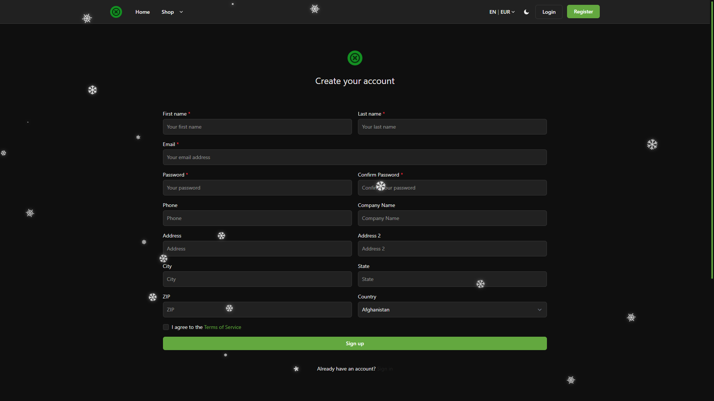
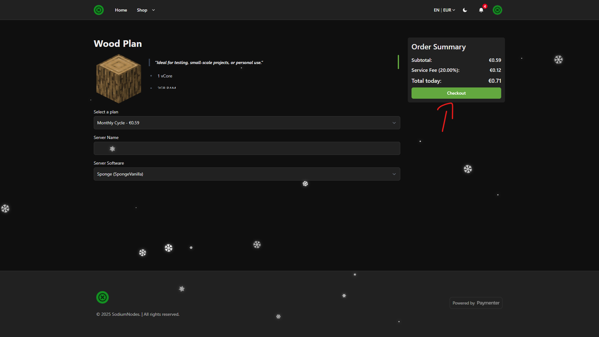

# Getting your first server
We appreciate your interest in getting your first server at SodiumNodes! Here's a quick and easy guide to how you can get your first server on SodiumNodes.

### (1) - Creating an account

Navigate to the [dashboard](https://billing.sodiumnodes.org), and on the top-right of the screen, click "Register".

**Fill in the details accordingly:**

Great! You have now created an account on the dashboard.

### (2) - Buying a service

Once you have created an account, buy a service. The process is straightforward.

At this point, you will have added your service to the cart. Click "Checkout".

You should have now reached your order summary. From here, you can add a coupon if you want to use one, agree to the Terms of Service (ToS), and click "Checkout" again.

Once you have done this, an invoice should be generated on your account. All you need to do is pay it.

Nice! As soon as you have paid your invoice, you should receive a password reset email from the [panel](https://panel.sodiumnodes.org). Please follow the instructions to reset your password and start using your service.

:::warning

We are aware of some cases where the e-mail doesn't send, or the server isn't created. Please **create a ticket immediately** if this ever happens. We are here to help.

:::

Once you have gained access to the panel, you can use your service normally. Thank you for purchasing from **SodiumNodes**!

If any problems remain, or you have any doubts, feel free to **create a ticket** or **contact us** at support@sodiumnodes.org.