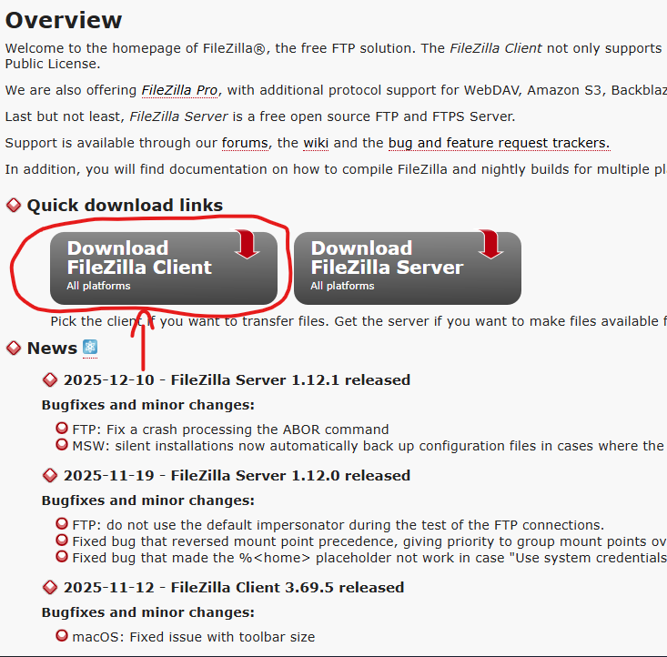
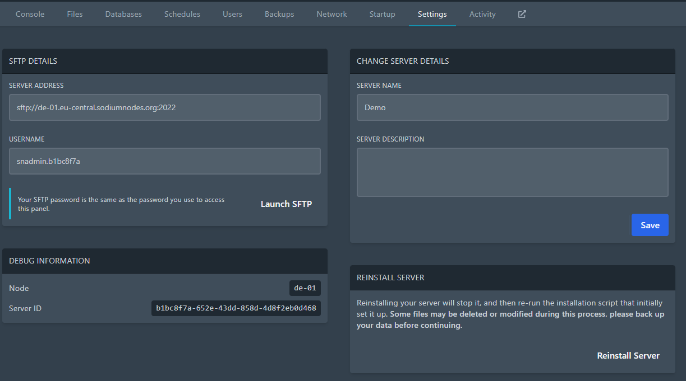

# Using SFTP

One of the most frequently asked questions includes "What do I do if the file I'm trying to upload is more than 100MB which is the upload limit"? The answer is simple: **use SFTP**.

SFTP stands for **S**ecure **F**ile **T**ransfer **P**rotocol, and is the encrypted version of FTP. Today we're going to see how to use this protocol to ensure large files get uploaded to the server.

### (1) - Download a SFTP client

There are many SFTP clients out there, but the one we recommend and we'll be using today is **FileZilla**.

Go to https://filezilla-project.org/ and click "Download FileZilla Client".

Once you have downloaded the client, install and run it.

### (2) - Connecting to your server's SFTP

Now that you have the SFTP client installed, and you have it running, you need to now connect to your server using SFTP.

Go to your server (on the [panel](https://panel.sodiumnodes.org)) and navigate over to "Settings".

From here, you can acquire the details you need to input into FileZilla:

- **Host**: your server address.
- **Username**: the username given in the "SFTP Details" box.
- **Password**: The password you use to log in to the [panel](https://panel.sodiumnodes.org).
- **Port**: can be left blank. It will be filled in automatically.